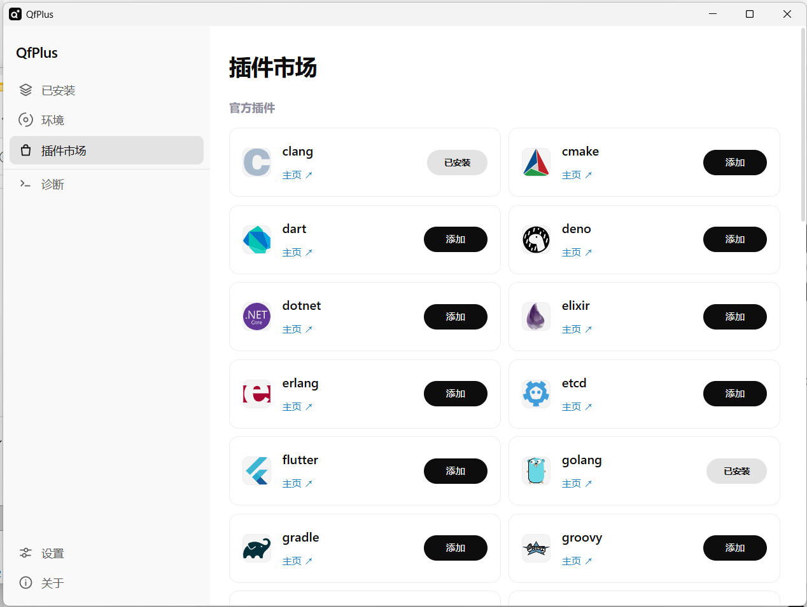

# QfPlus

[English README](README.md)

<p align="center">
  <a href="https://github.com/qfbsk/QfPlus/">https://github.com/qfbsk/QfPlus/</a>
</p>

<p align="center">
  
</p>

<p align="center">
  <strong>vfox 图形化管理界面 · Wails + Vue 3</strong>
</p>

<p align="center">
  在桌面图形界面里统一管理 vfox SDK、插件、系统 SDK 和 PATH 集成。
</p>

---

## 截图



## 下载

已发布版本可以在本仓库的 Releases 页面下载。

QfPlus 基于 Wails 构建，发布 Windows amd64 版本：

| 平台 | 产物 |
| --- | --- |
| Windows amd64 安装包 | `QfPlus-windows-amd64-installer.exe` |
| Windows amd64 便携版 | `QfPlus-windows-amd64-portable.zip` |

便携版不需要安装，也不需要管理员权限：把整个 `QfPlus` 文件夹解压到任意位置后直接运行 `QfPlus.exe`。配置和已下载的 SDK 仍然写在 `%APPDATA%\QfPlus`。

QfPlus 用 Go 和 Vue 编写，本身是跨平台的，仓库里各平台的打包资产也都保留着：Windows 用 NSIS 脚本、macOS 用 `build/darwin` 的 plist、Linux 用 `nfpm.yaml.tmpl`。Windows amd64 在这台机器上构建并验证；Wails 拒绝跨平台构建，所以 macOS 和 Linux 要在各自系统上编译——可以在那台机器上手工做，也可以走手动触发的 `Build non-Windows artifacts` workflow，它会下载对应平台的 `core/<os>/<arch>` 二进制，构建完把产物作为构建文件交回给你下载。

## 功能

- SDK 管理：查看、安装、卸载、切换和取消使用 vfox 管理的 SDK 版本。
- 自定义 SDK：添加系统里已有的 SDK，从可执行文件检测版本，并通过统一入口切换。
- 插件市场：浏览 vfox 插件、添加插件、移除插件，并在需要时保留自定义 SDK 路径。
- 发布版本感知搜索：没有 Release 的版本会显示为可重试状态，不会锁死 SDK 按钮。
- 内置代理：在设置里自行导入订阅地址，可选择节点分组或单个节点并测试延迟。程序不内置也不预存任何服务器、节点或订阅，代理只作用于本程序自己启动的子进程，不会修改系统代理设置。
- PATH 集成：添加或移除用户 PATH 中的 vfox，并在支持的平台管理 SDK 命令覆盖。
- Windows 兼容：处理应用执行别名冲突、junction、隐藏 PowerShell 辅助窗口和安装器清理。
- 下载目录迁移：先查看「会复制 / 仅列出」的迁移计划，再用进度反馈迁移 vfox home/download 位置。
- 双语 UI 与文档：中文和英文资源保持并行维护。

## 文档

| 主题 | English | 中文 |
| --- | --- | --- |
| 文档索引 | [docs/README.md](docs/README.md) | [docs/README.zh-CN.md](docs/README.zh-CN.md) |
| 架构 | [docs/ARCHITECTURE.md](docs/ARCHITECTURE.md) | [docs/ARCHITECTURE.zh-CN.md](docs/ARCHITECTURE.zh-CN.md) |
| 开发 | [docs/DEVELOPMENT.md](docs/DEVELOPMENT.md) | [docs/DEVELOPMENT.zh-CN.md](docs/DEVELOPMENT.zh-CN.md) |
| 发布 | [docs/RELEASE.md](docs/RELEASE.md) | [docs/RELEASE.zh-CN.md](docs/RELEASE.zh-CN.md) |
| 代码规范 | [docs/CODE_STYLE.en.md](docs/CODE_STYLE.en.md) | [docs/CODE_STYLE.md](docs/CODE_STYLE.md) |
| 前端 | [frontend/README.md](frontend/README.md) | [frontend/README.zh-CN.md](frontend/README.zh-CN.md) |
| 构建资源 | [build/README.md](build/README.md) | [build/README.zh-CN.md](build/README.zh-CN.md) |

## 架构概览

```text
+------------------------------+
| Frontend: Vue 3 + TypeScript |
| components / composables     |
| services / i18n / styles     |
+--------------+---------------+
               |
| Wails generated bindings
               v
+--------------+---------------+
| Backend: internal/app        |
| facade / sdk / plugin / environment |
| config / path / platform     |
+--------------+---------------+
               |
               | command execution
               v
+--------------+---------------+
| vfox CLI core                |
| bundled in release builds    |
+------------------------------+
```

仓库根目录现在只保留 Wails 启动入口 `main.go`。后端应用逻辑放在 `internal/app`，DTO 放在 `internal/model`，纯 vfox 输出解析器放在 `internal/parser`。暴露给 Wails 的公开方法集中在 `internal/app/app_facade_*.go`，业务流程拆到 `sdk_use.go`、`plugin_remove.go`、`migration_run.go`、`environment_import.go` 等文件。

前端遵循组件、组合式函数、服务的依赖方向：

```text
components -> composables -> services -> frontend/wailsjs
```

组件负责渲染和用户事件，composable 负责页面状态和业务流程，service 是唯一直接导入 Wails 生成绑定的层。

## vfox Core

QfPlus 通过 `core/` 下的外部可执行文件调用 vfox 引擎和 mihomo 代理内核。没有任何自动下载，需要你手动放好：

```text
core/
  windows/
    x86_64/vfox.exe          # 来自 https://github.com/version-fox/vfox/releases
    x86_64/mihomo.exe        # 来自 https://github.com/MetaCubeX/mihomo/releases
    x86/vfox.exe
    x86/mihomo.exe
```

运行时这两个文件在同一目录下查找，缺少 `mihomo.exe` 只会让内置代理无法启动，其余功能不受影响。`core/` 已被 Git 忽略，本地二进制不会提交到仓库。

## 开发

环境要求：

| 工具 | 版本 |
| --- | --- |
| Go | 1.23+ |
| Node.js | 22+ |
| Wails CLI | v2 |
| NSIS | 3.x，仅 Windows 安装包需要 |

安装前端依赖：

```bash
npm --prefix frontend install
```

运行桌面应用：

```bash
wails dev
```

验证项目：

```bash
go test ./...
npm --prefix frontend run build
```

本地构建：

```bash
wails build -clean
```

构建 Windows amd64 安装包：

```bash
wails build -platform windows/amd64 -nsis -clean
```

## 项目结构

```text
QfPlus/
  main.go                        Wails 启动和 app 绑定入口
  internal/
    app/                         Wails facade 和有状态后端流程
    model/                       与生成前端绑定共享的 DTO
    parser/                      vfox 命令输出纯解析器
    pathutil/                    路径比较和 PATH 清洗 helper
    storage/                     JSON 文件持久化 helper
  frontend/                      Vue 3 前端
  build/                         图标、manifest、安装脚本
  docs/                          中英双语项目文档
  tools/
    genicon/                     生成 build/appicon.png、icon.ico 和界面标识
```

改动标识几何后，重新生成全部图标产物：

```bash
go run ./tools/genicon
```

## 发布流程

发布是在装有上述工具链的 Windows 机器上手工完成的。先构建安装包：

```bash
wails build -platform windows/amd64 -nsis -clean
```

产物是 `build/bin/QfPlus.exe` 和 `build/bin/QfPlus-amd64-installer.exe`，把后者改名为 `QfPlus-windows-amd64-installer.exe`。

再按下面的结构摆放便携版目录，让 core 紧挨着可执行文件，然后把这个文件夹整体压缩：

```text
QfPlus/
  QfPlus.exe
  README.txt
  core/windows/x86_64/vfox.exe
  core/windows/x86_64/mihomo.exe
```

最后把安装包和 `QfPlus-windows-amd64-portable.zip` 一起上传到 GitHub 的 Releases 页面。完整清单和发版前的验证步骤见 `docs/RELEASE.zh-CN.md`。

## 致谢

感谢 [vfox](https://github.com/version-fox/vfox) 项目提供跨平台版本管理引擎，QfPlus 基于它构建图形化体验。

本程序的图形界面由 QfPlus 自行设计，页面结构与交互骨架参考了 HuajiFruit 的 vfoxG。

感谢千问3.8-Flash（Qwen）在本次工作中提供了莫大的帮助：代码梳理、方案拟定、改动核对与文档编写都有它的参与。

作者：清枫不识客
